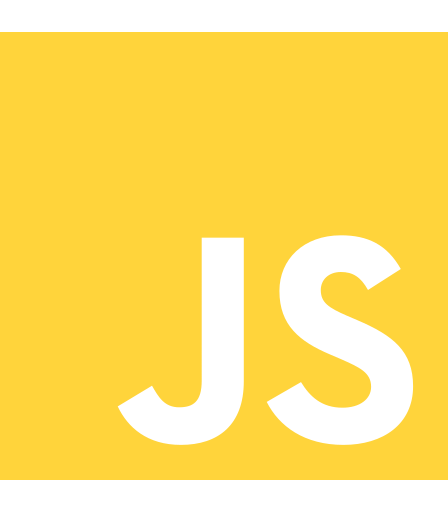

# GLEISSON SANTOS VIEIRA
## Resumo
Ola me chamo Gleisson 👋
Sou formado no curso de **tecnológo em gestão de tecnologia da informação** desde então apaixonado por Tecnologia, atulmente curso **engenharia de softare (UTFPR)**, gosto muito de testar novas linguagems e tecnologias.
## Hard Skills
- **Front-end (HTML, CSS, JavaScript)**      
- **Java**   
- **C**   
- **Python**   
- **Ruby e Ruby on Rails (aprendendo)**   
## Contato 
 **E-mail** <a href="mailto:gleissonsantosvieira065@gmail.com">gleissonsantosvieira065@gmai.com</a>
 
 **Linkedin:** <a href="https://www.linkedin.com/in/gleisson-santos-vieira/">https://www.linkedin.com/in/gleisson-santos-vieira/</a>
